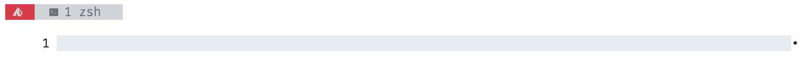

# xotodot-tmux-tile

A clean, light tmux navigation theme that celebrates the lights ! 🔆

### Installation using TPM

In your `tmux.conf`:
```
set -g @plugin "xotodot/xotodot-tmux-tile"
```

### Snapshots


